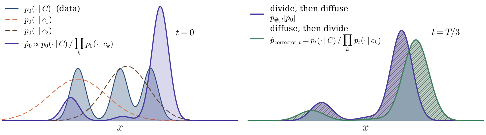
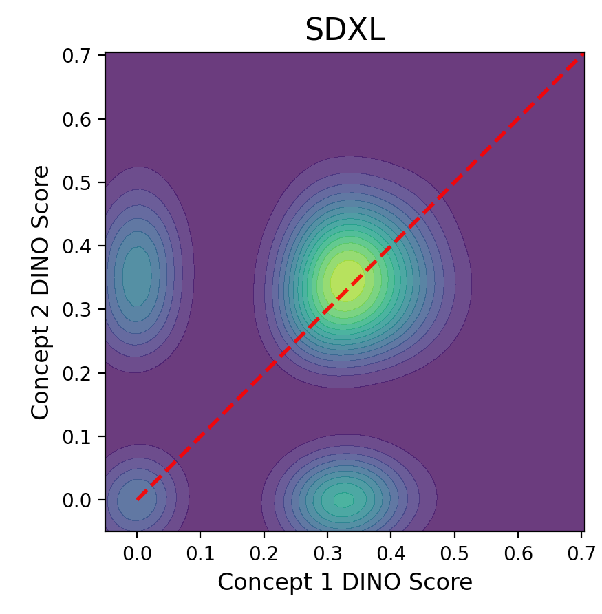

# `TILT`: Model-Intrinsic Reward Alignment for Compositional Diffusion

Official anonymous implementation accompanying the paper **TILT**. This repository provides compact, single-prompt demonstrations of compositional guidance for:

- **SDXL** text-to-image generation; and
- **AudioLDM2** text-to-audio generation.

The release is intentionally limited to demonstration inference. Dataset generation, benchmark prompt sets, hyperparameter sweeps, and evaluation pipelines are not included during anonymous review.

<p align="center">
  
</p>

The figure above illustrates the central non-commutativity motivating TILT. The source-quality vector figure is also provided as [`assets/pushforward_ratio.pdf`](assets/pushforward_ratio.pdf).

## Overview

Diffusion models can omit or weaken part of a compositional prompt even when they generate a plausible image or audio clip. For a full prompt `C` with concepts or events `c_1, ..., c_K`, this release contrasts the full-prompt score with the individual concept-conditioned scores during inference. The resulting reward is used to correct early latent states and reduce domination by a single concept.

At a high level, each demo:

1. Decomposes the input into individual concepts or acoustic events.
2. Encodes the full prompt and each component with the pretrained model's text encoders.
3. Runs the original denoising trajectory.
4. Estimates a concept-contrasting reward at selected early timesteps.
5. Corrects the latent and continues standard sampling.

No model fine-tuning or additional learned parameters are required.

## Repository layout

```text
.
├── assets/
│   ├── pushforward_ratio.{png,pdf}
│   ├── qualitative_results.{png,pdf}
│   └── concept_dominance_sdxl.png
├── tilt/
│   ├── __init__.py
│   ├── gaussian_smoothing.py
│   └── text_utils.py
├── examples/
│   ├── demo_audioldm2.py
│   └── demo_sdxl.py
├── scripts/
│   ├── run_audioldm2_demo.sh
│   └── run_sdxl_demo.sh
├── LICENSE
├── README.md
└── requirements.txt
```

## Requirements

- Linux with Python 3.10 or 3.11
- A CUDA-capable GPU
- A recent NVIDIA driver compatible with the selected PyTorch build
- Enough GPU memory for backpropagation through the diffusion model during inference
- Internet access on the first run to download Hugging Face checkpoints

CPU execution is not supported by these demonstration scripts. Correction is more memory intensive than ordinary inference because it differentiates through denoiser evaluations.

## Installation

### 1. Create an environment

Using `venv`:

```bash
python3.10 -m venv .venv
source .venv/bin/activate
python -m pip install --upgrade pip
```

Or with Conda:

```bash
conda create -n tilt python=3.10 -y
conda activate tilt
python -m pip install --upgrade pip
```

### 2. Install PyTorch

Install a CUDA build that matches the local driver. For example, for CUDA 12.4:

```bash
pip install torch==2.6.0 torchvision==0.21.0 \
  --index-url https://download.pytorch.org/whl/cu124
```

Use the [PyTorch installation selector](https://pytorch.org/get-started/locally/) if another CUDA build is required.

### 3. Install the remaining dependencies

```bash
pip install -r requirements.txt
python -m spacy download en_core_web_trf
```

`xformers` is optional. With a compatible build, SDXL uses its memory-efficient attention path; otherwise the demo falls back to an available PyTorch implementation.

### 4. Configure Hugging Face access

The default checkpoints are:

- `stabilityai/stable-diffusion-xl-base-1.0`
- `madebyollin/sdxl-vae-fp16-fix`
- `cvssp/audioldm2`

If a checkpoint requires license acceptance, accept it on the model page and authenticate locally:

```bash
huggingface-cli login
```

Never place access tokens in scripts or commit them to the repository.

## SDXL demo

Run the provided example:

```bash
bash scripts/run_sdxl_demo.sh
```

Equivalent explicit command:

```bash
python examples/demo_sdxl.py \
  --prompt "a hairy shark and two spotted clams" \
  --seed "[1688]" \
  --guidance_scale 5.0 \
  --n_timesteps 50 \
  --algo_version energy \
  --correction_mode correct-tweedie \
  --num_ts_to_correct "[5]" \
  --num_latent_corrector_steps 1 \
  --init_latent_corrector_steps 10 \
  --output_dir outputs/sdxl
```

The PNG and a YAML record of the resolved configuration are stored below `outputs/sdxl/`.

### Manual concept decomposition

The demo uses spaCy noun chunks by default. For unusual syntax, attributes, or repeated nouns, provide a `+`-separated decomposition:

```bash
python examples/demo_sdxl.py \
  --prompt "a red cube beside a blue sphere" \
  --concept "a red cube+a blue sphere" \
  --seed "[0]" \
  --algo_version energy \
  --num_ts_to_correct "[5]"
```

Do not append the full prompt to `--concept`; the demo adds it internally.

### Matched baseline

Use the same prompt, seed, scheduler, and guidance scale while disabling correction:

```bash
python examples/demo_sdxl.py \
  --prompt "a red cube beside a blue sphere" \
  --concept "a red cube+a blue sphere" \
  --seed "[0]" \
  --num_ts_to_correct "[0]" \
  --output_dir outputs/sdxl_baseline
```

## AudioLDM2 demo

Run the provided example:

```bash
bash scripts/run_audioldm2_demo.sh
```

Equivalent explicit command:

```bash
python examples/demo_audioldm2.py \
  --prompt "rain falling, followed by a crash of thunder" \
  --seed "[1688]" \
  --guidance_scale 3.5 \
  --audio_length_in_s 10.24 \
  --n_timesteps 50 \
  --algo_version energy \
  --correction_mode correct-tweedie \
  --num_ts_to_correct "[5]" \
  --num_latent_corrector_steps 1 \
  --init_latent_corrector_steps 10 \
  --output_dir outputs/audioldm2
```

The waveform is stored as a WAV file below `outputs/audioldm2/`. Add `--save_mel_png` for a mel-spectrogram preview.

### Manual event decomposition

The automatic parser separates common temporal connectors such as “followed by,” “while,” and “then.” Override it when necessary:

```bash
python examples/demo_audioldm2.py \
  --prompt "a dog barking while rain falls" \
  --concept "a dog barking+rain falls" \
  --seed "[0]" \
  --algo_version energy \
  --num_ts_to_correct "[5]"
```

### Matched baseline

```bash
python examples/demo_audioldm2.py \
  --prompt "a dog barking while rain falls" \
  --concept "a dog barking+rain falls" \
  --seed "[0]" \
  --num_ts_to_correct "[0]" \
  --output_dir outputs/audioldm2_baseline
```

## Important arguments

| Argument | Meaning | Typical demo value |
|---|---|---|
| `--prompt` | Full text condition | task dependent |
| `--concept` | Optional `+`-separated decomposition | inferred if omitted |
| `--seed` | Python-style list of integer seeds | `"[1688]"` |
| `--n_timesteps` | DDIM denoising steps | `50` |
| `--guidance_scale` | Classifier-free guidance strength | `5.0` SDXL, `3.5` audio |
| `--num_ts_to_correct` | Number or list of early steps to correct | `"[5]"` |
| `--num_latent_corrector_steps` | Inner corrections after initialization | `1` |
| `--init_latent_corrector_steps` | Inner corrections at initial corrected steps | `10` |
| `--algo_version` | Reward/corrector variant | `energy` |
| `--correction_mode` | Latent update rule | `correct-tweedie` |
| `--eta` | Correction strength | `0.8` |
| `--energy_num_samples` | Monte Carlo energy samples | `2` |
| `--output_dir` | Root output directory | `outputs/...` |

Start by varying only the prompt, decomposition, seed, and output directory. Included values are demonstration defaults, not universal optimal settings.

## Reproducibility

- Each requested seed reinitializes Python, NumPy, and PyTorch random number generators.
- Resolved configurations are saved beside outputs.
- AudioLDM2 enables deterministic CUDA algorithms and fails explicitly if the installed stack cannot provide them.
- Compare corrected and uncorrected samples with identical seeds and sampling settings.
- Hardware and dependency versions can affect floating-point results. Record `pip freeze`, GPU model, and driver version for archival runs.

## Figures and qualitative examples

The repository includes publication-ready previews and their source PDFs:

### Qualitative comparison

<p align="center">
  
</p>

[Open the vector PDF](assets/qualitative_results.pdf)

### Concept dominance analysis

<p align="center">
  
</p>

The DINO-score density visualizes concept imbalance in SDXL. The dashed diagonal marks equal scores for both concepts.

## Troubleshooting

### CUDA out of memory

Close other GPU processes and begin with one seed and fewer corrected timesteps. Gradient-based correction is the dominant memory cost. A compatible `xformers` build may also help SDXL.

### `en_core_web_trf` cannot be imported

Install the model inside the active environment:

```bash
python -m spacy download en_core_web_trf
```

### Model access error

Confirm that the model license has been accepted and that `huggingface-cli whoami` reports the intended account.

### Audio determinism error

The AudioLDM2 demo deliberately requests deterministic CUDA kernels. Begin with the documented PyTorch/CUDA versions; changing the stack may select an unsupported kernel.

## Scope of this release

Included:

- single-prompt SDXL inference;
- single-prompt AudioLDM2 inference;
- automatic and manual concept/event decomposition;
- corrected and matched-baseline generation; and
- optional intermediate diagnostics.

Not included:

- benchmark prompt files;
- dataset download or preprocessing;
- large-scale generation launchers;
- quantitative evaluation scripts; or
- unpublished qualitative results.

## License and third-party software

This code is released under the MIT License. Model weights, datasets, and dependencies retain their own licenses and terms. Portions of the implementation build on public diffusion-model tooling; review upstream licenses before redistribution.

## Citation

Citation metadata will be added after anonymous review.

```bibtex
@inproceedings{anonymous2027tilt,
  title     = {TILT},
  author    = {Anonymous},
  booktitle = {Under anonymous review},
  year      = {2027}
}
```
